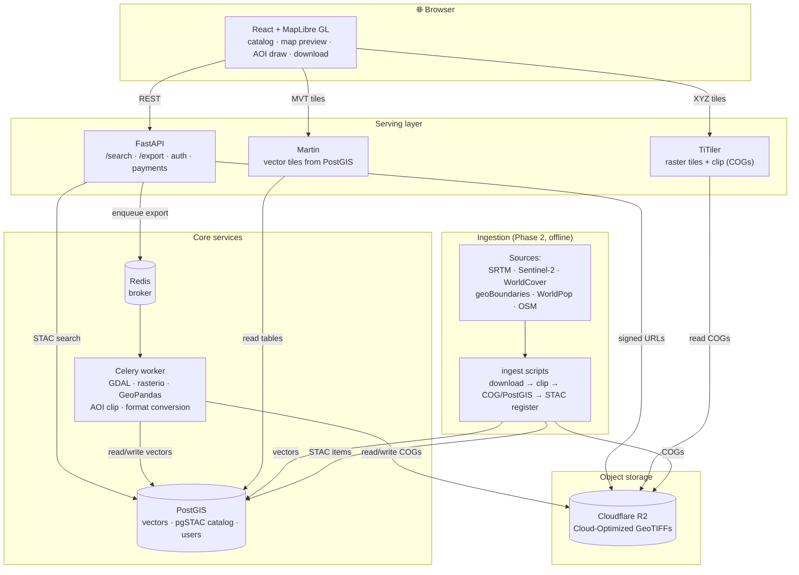

# Cameroon Geospatial Data Portal

A searchable, downloadable catalog of **license-clear** raster & vector data for
Cameroon. Browse by theme and region, preview on a map, clip to an area of
interest (AOI), and download in the format you need — or pull data through an API.

A modest paid tier exists **purely to cover running costs** (hosting, bandwidth,
maintenance) and value-added convenience (pre-clipping, format conversion, AOI
processing). **The portal never charges for the data rights themselves — those
remain open.**

> **Status:** 🚧 MVP in active development. Phase 1 (repo & skeleton) complete.
> See [Build phases](#build-phases).

---

## 🔑 The licensing principle (read first)

Because the portal **redistributes** data and **charges** a fee, license
compatibility is the foundation of the whole project. *"Free to download"* does
**not** mean *"free to redistribute or sell."*

**Only three license types are ingested:**

- **Public Domain / CC0** — redistribute and charge freely, no attribution.
- **CC-BY 4.0** — redistribute and charge freely, attribution preserved.
- **ODbL (OpenStreetMap)** — redistribution & sale allowed, but **share-alike**:
  kept in a **separate ODbL tier** so it never contaminates other products.

**Never ingested:** GADM, FAO GAUL, DIVA-GIS boundaries, any CC-BY-NC layer, or
Cameroon national-agency proprietary data. We use **geoBoundaries (CC-BY)** for
administrative boundaries instead of GADM.

> **Every dataset carries `license` + `attribution` as mandatory catalog fields,
> shown in the UI and bundled into every download.**

Full details and the per-layer table: **[data-licenses.md](data-licenses.md)**.

---

## 🗺️ MVP scope — six license-clean layers

All clipped to Cameroon's national boundary:

| # | Layer | Theme | License | Tier |
|---|---|---|---|---|
| 1 | SRTM 30 m DEM | Elevation | Public Domain | open |
| 2 | Sentinel-2 cloud-free mosaic | Optical imagery | Copernicus (free & open) | open |
| 3 | ESA WorldCover 10 m | Land cover | CC-BY 4.0 | open |
| 4 | geoBoundaries ADM0–ADM3 | Admin boundaries | CC-BY 4.0 | open |
| 5 | WorldPop | Population | CC-BY 4.0 | open |
| 6 | OpenStreetMap roads | Transport | **ODbL** | **osm-odbl** |

---

## 🏗️ Architecture



### Tech stack

| Layer | Technology | Role |
|---|---|---|
| Storage | Cloudflare R2 (S3-compatible), COGs | Cheap, egress-friendly raster storage |
| Database | PostGIS | Vectors + metadata + users |
| Catalog | STAC (pgSTAC / stac-fastapi) | Standard dataset catalog; `license`+`attribution` required |
| Raster serving | TiTiler | Dynamic tiling & clipping of COGs |
| Vector serving | Martin | Vector tiles from PostGIS |
| API | FastAPI | Search, export, auth, payments |
| Worker | GDAL + rasterio + GeoPandas + Celery | AOI clipping, format conversion |
| Frontend | React + MapLibre GL | Map UI, search, AOI tool, downloads |
| Payments | Flutterwave + Stripe (sandbox) | Mobile money (MoMo/Orange) + cards |
| Deployment | Docker Compose | Whole stack via `docker compose up` |

---

## 📁 Repository layout

```
cameroon-geoportal/
├── api/         FastAPI app — /search, /export, auth, payments
├── worker/      Celery worker — GDAL/rasterio/GeoPandas processing
├── frontend/    React + MapLibre GL client
├── catalog/     STAC catalog definitions & helpers
├── ingest/      Per-dataset download → clip → COG/PostGIS → STAC scripts
├── infra/       PostGIS init SQL, TiTiler & Martin config
├── docker-compose.yml
├── .env.example
├── data-licenses.md
└── README.md
```

---

## 🚀 Quick start (local)

> Prerequisites: Docker + Docker Compose v2, ~10 GB free disk. GDAL/psql are **not**
> required on the host — they ship inside the `worker` and `db` containers.

```bash
git clone https://github.com/mbongowo/cameroon-geoportal.git
cd cameroon-geoportal

# 1. configure environment (no secrets committed)
cp .env.example .env          # then edit values as needed

# 2. validate the compose file
docker compose config -q

# 3. boot the whole stack
docker compose up --build
```

Services once up:

| Service | URL |
|---|---|
| Frontend | http://localhost:5173 |
| API (docs) | http://localhost:8000/docs |
| TiTiler | http://localhost:8001/docs |
| Martin | http://localhost:3000 |
| PostGIS | localhost:5432 |

Data ingestion (Phase 2) runs inside the worker container, e.g.:

```bash
docker compose run --rm worker python /ingest/run.py --layer srtm
```

### Teardown

```bash
docker compose down            # stop containers
docker compose down -v         # stop and remove volumes (deletes local DB/exports)
```

---

## 🔐 Secrets & credentials

- **No secrets in git.** All config comes from `.env` (git-ignored). Copy
  `.env.example` and fill in.
- Cloud (R2), data-source logins (NASA Earthdata, Copernicus), and payment keys
  are **requested from the maintainer** — never invented or committed.
- **Payment keys are sandbox/test only** until launch.

---

## 🧭 Build phases

| Phase | Scope | Status |
|---|---|---|
| 1 | Repo & skeleton (layout, compose, README, licensing policy) | ✅ done |
| 2 | Catalog & ingestion (6 datasets → clip → COG/PostGIS → STAC) | ⏳ next |
| 3 | Serving (TiTiler previews/clip, Martin tiles, `/search` + `/export`) | ⏳ |
| 4 | Frontend (catalog, map preview, AOI draw/upload, download panel, license badges) | ⏳ |
| 5 | Accounts & payments (auth, API keys, free + pay-per-export tiers, Flutterwave/Stripe sandbox) | ⏳ |
| 6 | Docs & polish (run/teardown docs, license table, CONTRIBUTING) | ⏳ |

---

## 💸 Cost-recovery model

Sustainability, not profit. A **free tier** (browse, preview, small AOI downloads,
all open layers) plus a **pay-per-export tier** (large/bulk clips, premium
formats). Mobile money (MTN MoMo / Orange Money via Flutterwave) is first-class
for the Cameroon market; cards via Stripe. The OSM/ODbL tier stays free and
openly licensed to honor share-alike.

---

## 📜 License

- **Source code:** MIT — see [LICENSE](LICENSE).
- **Data:** each dataset keeps its own license (Public Domain / CC-BY / ODbL).
  See [data-licenses.md](data-licenses.md). The code license does **not** relicense
  the data.
